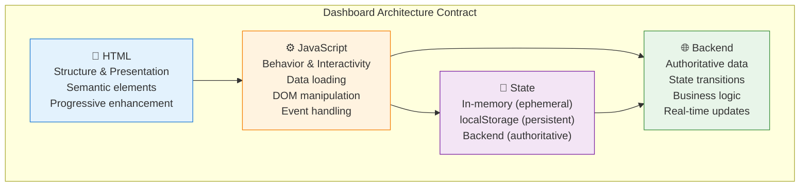

# Dashboard Standardization Guide

**Purpose:** Master guide for standardizing dashboards using the Dashboard Architecture Contract.

**Last Updated:** 2026-01-20  
**Version:** 1.0.0

---

## Quick Start

1. **Read the Architecture Contract:**
   - `DASHBOARD_ARCHITECTURE.md` - What HTML/JS/state/backend are responsible for
   - `DASHBOARD_LANGUAGE_MAP.md` - Standardized terminology
   - `DASHBOARD_DECISION_RUBRIC.md` - When to use what

2. **Audit Your Dashboard:**
   - Use `DASHBOARD_AUDIT_CHECKLIST.md` to check each item

3. **Standardize:**
   - Copy `MASTER_DASHBOARD_PROMPT.md` and paste into agent conversation
   - Replace `[DASHBOARD_FILE_PATH]` with your dashboard file
   - Agent will standardize according to architecture contract

---

## Document Index

### 📐 Architecture Documents

| Document | Purpose | When to Use |
|----------|---------|-------------|
| `DASHBOARD_ARCHITECTURE.md` | Defines what HTML/JS/state/backend are responsible for | Read first, understand boundaries |
| `DASHBOARD_LANGUAGE_MAP.md` | Standardized terminology for discussions | Use when writing code/docs/questions |
| `DASHBOARD_DECISION_RUBRIC.md` | Decision rules for when to use what | Use when adding new features |
| `DASHBOARD_AUDIT_CHECKLIST.md` | Step-by-step audit checklist | Use when standardizing existing dashboard |

### 🚀 Implementation Documents

| Document | Purpose | When to Use |
|----------|---------|-------------|
| `MASTER_DASHBOARD_PROMPT.md` | Copy-pasteable prompt for agent standardization | Use when asking agent to standardize dashboard |

---

## Architecture Overview



---

## Standard Patterns

### Pattern 1: Data Loading (Hybrid)

```javascript
// Priority: Backend → File Picker → Embedded → Error
async function loadDashboardData() {
    if (DASHBOARD_CONFIG.backendEnabled) {
        try {
            return await dashboardAPI.getState();
        } catch (error) {
            showConnectionAlert(error);
            // Fall through to file picker
        }
    }
    
    if (DASHBOARD_CONFIG.filePickerEnabled) {
        return await loadViaFilePicker();
    }
    
    if (DASHBOARD_CONFIG.embeddedData) {
        return DASHBOARD_CONFIG.embeddedData;
    }
    
    handleError(new Error('No data source'), {
        fixSteps: ['Start backend', 'Use file picker', 'Check embedded data']
    });
}
```

### Pattern 2: Error Handling

```javascript
function handleError(error, context = {}) {
    const errorCard = document.createElement('div');
    errorCard.className = 'error-boundary';
    errorCard.innerHTML = `
        <div class="error-header">⚠️ ${error.message}</div>
        <div class="error-context">Where: ${context.location}</div>
        <div class="error-fix">
            <strong>How to fix:</strong>
            <ol>
                ${(context.fixSteps || []).map(step => `<li>${step}</li>`).join('')}
            </ol>
        </div>
    `;
    document.body.insertBefore(errorCard, document.body.firstChild);
    console.error('Dashboard Error:', error, context);
}
```

### Pattern 3: Mermaid Loading

```javascript
async function loadMermaidDiagram(diagramName) {
    const searchPaths = [
        '.userInput/mermaid/',
        'diagrams/',
        '../diagrams/',
        'artifacts/*/diagrams/'
    ];
    
    for (const path of searchPaths) {
        try {
            const content = await fetch(`${path}${diagramName}.mmd`).then(r => r.text());
            return content;
        } catch (e) {
            // Continue to next path
        }
    }
    
    handleError(new Error(`Diagram not found: ${diagramName}`), {
        fixSteps: [
            `Create .userInput/mermaid/${diagramName}.mmd`,
            `Or use file picker to load manually`
        ]
    });
}
```

---

## Decision Flowchart

```
┌─────────────────────────────────────┐
│ Does it change based on user input? │
└──────────────┬──────────────────────┘
               │
        ┌──────┴──────┐
        │             │
       NO            YES
        │             │
        ▼             ▼
   Static HTML   ┌──────────────────────┐
                 │ Does it change based │
                 │ on backend data?     │
                 └──────┬───────────────┘
                        │
                 ┌──────┴──────┐
                 │             │
                NO            YES
                 │             │
                 ▼             ▼
            JS + File    ┌──────────────────┐
            Picker       │ Does it need to  │
                         │ persist/shared?  │
                         └──────┬───────────┘
                                │
                         ┌──────┴──────┐
                         │             │
                        NO            YES
                         │             │
                         ▼             ▼
                    JS + In-Memory   ┌──────────────┐
                    State            │ User prefs?  │
                                     └──┬────────┬──┘
                                        │        │
                                       YES       NO
                                        │        │
                                        ▼        ▼
                                   JS +      Backend
                                   localStorage
```

---

## Standardization Workflow

### Step 1: Read Architecture Contract
- [ ] Read `DASHBOARD_ARCHITECTURE.md`
- [ ] Read `DASHBOARD_LANGUAGE_MAP.md`
- [ ] Read `DASHBOARD_DECISION_RUBRIC.md`

### Step 2: Audit Dashboard
- [ ] Open dashboard file
- [ ] Open dashboard in browser (test current behavior)
- [ ] Run through `DASHBOARD_AUDIT_CHECKLIST.md`
- [ ] Mark items that pass ✅
- [ ] Mark items that need fixing ❌

### Step 3: Standardize Dashboard
- [ ] Copy `MASTER_DASHBOARD_PROMPT.md`
- [ ] Replace `[DASHBOARD_FILE_PATH]` with actual path
- [ ] Paste into agent conversation
- [ ] Agent applies fixes according to architecture contract

### Step 4: Verify Changes
- [ ] Test with backend enabled
- [ ] Test with backend disabled (file picker fallback)
- [ ] Test error scenarios
- [ ] Test multi-tab sync (if applicable)
- [ ] Test auto-save (if applicable)

---

## Must-Have Items

Every dashboard MUST have:
- ✅ Semantic HTML structure
- ✅ JavaScript initialization pattern
- ✅ Error handling function
- ✅ Data loading with fallback (backend → file picker)
- ✅ Graceful degradation (works without backend)

Every dashboard SHOULD have:
- ⚠️ Connection status indicator (if backend enabled)
- ⚠️ Auto-save for forms (if dashboard has forms)
- ⚠️ Multi-tab sync (if state changes affect other tabs)

Every dashboard MAY have:
- 💡 Mermaid diagrams (if visualization needed)
- 💡 Backend integration (if state transitions needed)
- 💡 localStorage persistence (if preferences needed)

---

## Terminology Quick Reference

| ❌ Don't Say | ✅ Say Instead |
|-------------|---------------|
| Component | Element, Container, Function |
| Store | State, Data |
| Action | Handler, Function |
| Hook | Event Handler |
| Template | Structure, Pattern |
| View | Section, Container |
| Server | Backend |
| Chart | Diagram |
| Upload | Load, Select |
| Exception | Error |

---

## Common Anti-Patterns to Avoid

### ❌ Don't: Store Authoritative Data in localStorage
```javascript
// BAD
localStorage.setItem('artifacts', JSON.stringify(artifacts));

// GOOD: Backend is authoritative, localStorage is cache
const artifacts = await dashboardAPI.getArtifacts();
localStorage.setItem('artifacts_cache', JSON.stringify(artifacts));
```

### ❌ Don't: Put Dynamic Content in Static HTML
```html
<!-- BAD -->
<div class="stat">42</div>

<!-- GOOD -->
<div class="stat" id="stat-total-agents">0</div>
```

### ❌ Don't: Assume Backend Always Available
```javascript
// BAD
const state = await dashboardAPI.getState();

// GOOD: Try backend, fallback to file picker
try {
    return await dashboardAPI.getState();
} catch (error) {
    showConnectionAlert(error);
    return await loadViaFilePicker();
}
```

---

## Next Steps

1. **Start with one dashboard:**
   - Choose simplest dashboard (e.g., `mermaid_viewer.html`)
   - Apply audit checklist
   - Standardize using master prompt
   - Verify changes

2. **Then standardize remaining dashboards:**
   - Use same process for each dashboard
   - Consistency will emerge naturally
   - Patterns will become reusable

3. **Create shared utilities (future):**
   - `shared/dashboard-common.css` (shared styles)
   - `shared/dashboard-utils.js` (shared functions)
   - Reuse across all dashboards

---

**For questions or clarifications:**
- Review architecture documents
- Check language map for terminology
- Use decision rubric for new features
- Apply audit checklist before changes
