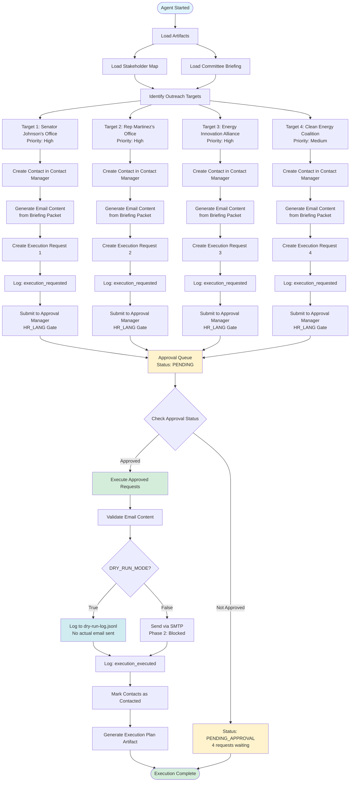

# Phase 2 Execution Flow - Mermaid Diagram

## Execution Flow Summary

### Phase 1: Artifact Loading
- Loaded stakeholder map (4 stakeholders)
- Loaded committee briefing packet

### Phase 2: Target Identification
- Identified 4 outreach targets
- Prioritized by alignment (allies first)
- Created contacts in contact manager

### Phase 3: Email Generation
- Generated personalized email content for each target
- Used briefing packet data for email body
- Included key points, agenda items, and asks

### Phase 4: Execution Request Creation
- Created 4 ExecutionRequest objects
- Set review gate: HR_LANG
- Set dry_run: True
- Set requires_approval: True

### Phase 5: Approval Submission
- Submitted all 4 requests to approval manager
- Logged execution_requested events
- Added to approval queue (status: PENDING)

### Phase 6: Approval Check
- Checked approval status (0 approved, 4 pending)
- No executions yet (awaiting human approval)

### Phase 7: Output Generation
- Generated execution plan artifact
- Documented all requests and status
- Ready for human review

## Current State

**Status:** PENDING_APPROVAL  
**Pending Requests:** 4  
**Approved Requests:** 0  
**Executed Requests:** 0  
**Dry-Run Mode:** Active (no emails sent)
